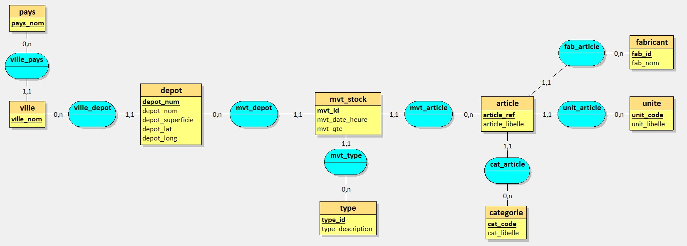

# 🗃️ Application de Gestion de Stock en C# (WPF + SQL Server Express)

Cette application est une **solution de gestion de stock** développée en **C# avec WPF**. Elle suit une **architecture en couches** pour garantir une séparation claire des responsabilités :

- **DAL (Data Access Layer)** : Gère l'accès aux données.
- **BLL (Business Logic Layer)** : Contient la logique métier.
- **UI (WPF)** : Interface graphique utilisateur.

La base de données est hébergée localement avec **SQL Server Express (LocalDB)**.

---

## 🧰 Technologies utilisées

- **Langage** : C# (.NET Platforme)
- **Interface utilisateur** : WPF (Windows Presentation Foundation)
- **Base de données** : SQL Server Express (LocalDB)
- **Connexion** : ADO.NET
- **Architecture** : En couches (DAL / BLL / UI)

---

## 📂 Architecture du projet

Le projet est organisé comme suit :

- `DAL/` : contient les classes d’accès aux données (requêtes SQL, connexion).
- `BLL/` : logique métier (validation des données, règles de gestion).
- `SLAM_AP2/` : projet principal WPF (interface graphique).

---

## 🎯 Fonctionnalités principales

- Affichage de la liste des produits en stock
- Ajout de nouveaux produits
- Modification d’un produit existant
- Suppression d’un produit
- Alertes en cas de stock faible

---

## 🛢️ Base de données



### Connexion

La chaîne de connexion utilisée est :

```csharp
string connectionString = "Server=SRV-SQL\\SQL_SLAM;Database=BD_STOCK_BEN_HASSINE;Trusted_Connection=True;";
```

### Schéma de la table `Produits`

```sql
CREATE TABLE Produits (
    Id INT PRIMARY KEY IDENTITY,
    Nom NVARCHAR(100) NOT NULL,
    Quantite INT NOT NULL,
    PrixUnitaire DECIMAL(10,2) NOT NULL,
    DateAjout DATETIME DEFAULT GETDATE()
);
```

---

## 🧠 Exemples de code

### Accès aux données (DAL) – Récupérer tous les produits

```csharp
public List<Article> GetAllProduits()
{
    List<Article> article = new List<Article>();
    using (SqlConnection con = new SqlConnection(connectionString))
    {
        SqlCommand cmd = new SqlCommand("SELECT * FROM article", con);
        con.Open();
        SqlDataReader reader = cmd.ExecuteReader();
        while (reader.Read())
        {
            produits.Add(new Produit
            {
                Id = (int)reader["Id"],
                Nom = reader["Nom"].ToString(),
                Quantite = (int)reader["Quantite"],
                PrixUnitaire = (decimal)reader["PrixUnitaire"]
            });
        }
    }
    return produits;
}
```

### Logique métier (BLL) – Ajouter un produit

```csharp
public void AjouterArticle(Article a)
{
    if (string.IsNullOrWhiteSpace(a.Libelle))
        throw new ArgumentException("Le nom du produit est requis.");
    if (a.Quantite < 0)
        throw new ArgumentException("Quantité invalide.");
    BLL_Article.AjouterProduit(a);
}
```

---

## ▶️ Démarrage du projet

1. Ouvre la solution `.sln` dans Visual Studio.
2. Crée la base de données `StockDB` dans SQL Server Express.
3. Vérifie la chaîne de connexion dans la DAL.
4. Lance le projet `SLAM_AP2` en tant que projet de démarrage.

---

## 🧼 Fichiers ignorés dans Git

Les dossiers `bin` et `obj` ne doivent pas être versionnés. Voici ce qu'on peut ajouter dans `.gitignore` :

```
**/bin/
**/obj/
```

---

## ✅ Bonnes pratiques appliquées

- Séparation des responsabilités via architecture en couches
- Chaîne de connexion sécurisée
- Interface WPF simple et fonctionnelle
- Organisation claire du code source

---

## 🚀 Améliorations futures possibles

- Système d'authentification avec rôles
- Exportation des données en CSV ou PDF
- Statistiques visuelles (graphiques, rapports)
- Intégration avec des API externes ou service web

---

## 👤 Auteur

**Youssef**  
Étudiant en BTS Sio
GitHub : [Xorcist15](https://github.com/Xorcist15)

---

## 📝 Licence

Projet open-source destiné à l’apprentissage. Utilisation libre à des fins pédagogiques.
